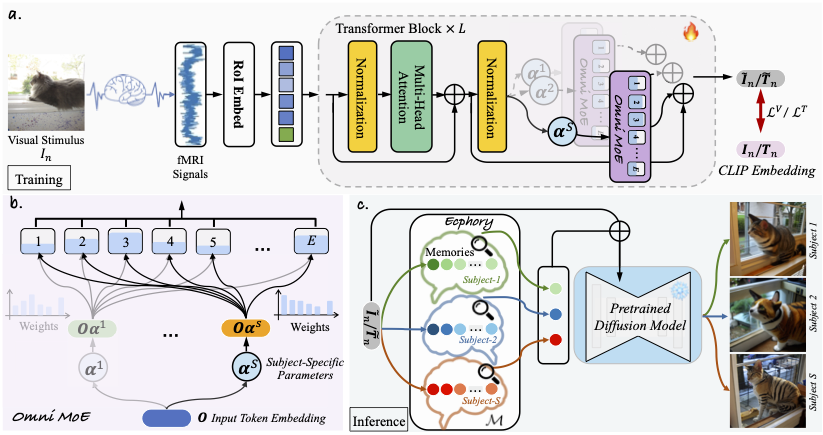

# Psychometry: An Omnifit Model for Image Reconstruction from Human Brain Activity
This is the official implementation of "Psychometry: An Omnifit Model for Image Reconstruction from Human Brain Activity" (Accepted at CVPR 2024).



>[Psychometry: An Omnifit Model for Image Reconstruction from Human Brain Activity]([https://arxiv.org/abs/2403.20022](https://openaccess.thecvf.com/content/CVPR2024/papers/Quan_Psychometry_An_Omnifit_Model_for_Image_Reconstruction_from_Human_Brain_CVPR_2024_paper.pdf)) <br>
>[Ruijie Quan](https://scholar.google.com/citations?user=WKLRPsAAAAAJ&hl=en), [Wenguan Wang](https://sites.google.com/view/wenguanwang), [Zhibo Tian], [Fan Ma](https://scholar.google.com/citations?user=FyglsaAAAAAJ&hl=en), [Yi Yang](https://scholar.google.com/citations?hl=zh-CN&user=RMSuNFwAAAAJ&view_op=list_works)
>

## Abstract

Reconstructing the viewed images from human brain activity bridges human and computer vision through the Brain-Computer Interface. The inherent variability in brain function between individuals leads existing literature to focus on acquiring separate models for each individual using their respective brain signal data, ignoring commonalities between these data. In this article, we devise Psychometry, an omnifit model for reconstructing images from functional Magnetic Resonance Imaging (fMRI) obtained from different subjects. Psychometry incorporates an omni mixture-of-experts (Omni MoE) module where all the experts work together to capture the inter-subject commonalities, while each expert associated with subject-specific parameters copes with the individual differences. Moreover, Psychometry is equipped with a retrieval-enhanced inference strategy, termed Ecphory, which aims to enhance the learned fMRI representation via retrieving from prestored subject-specific memories. These designs collectively render Psychometry omnifit and efficient, enabling it to capture both inter-subject commonality and individual specificity across subjects. As a result, the enhanced fMRI representations serve as conditional signals to guide a generation model to reconstruct high-quality and realistic images, establishing Psychometry as state-of-the-art in terms of both high-level and low-level metrics.


## Code

Coming soon...

## Citation

If you find this work useful in your research, please star our repository and consider citing:

```
@InProceedings{Quan_2024_CVPR,
    author    = {Quan, Ruijie and Wang, Wenguan and Tian, Zhibo and Ma, Fan and Yang, Yi},
    title     = {Psychometry: An Omnifit Model for Image Reconstruction from Human Brain Activity},
    booktitle = {Proceedings of the IEEE/CVF Conference on Computer Vision and Pattern Recognition (CVPR)},
    month     = {June},
    year      = {2024},
    pages     = {233-243}
}
```
